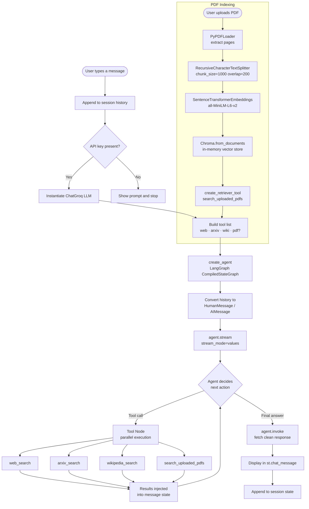

# LangChain Research Assistant


A conversational research assistant that combines **real-time web search**, **academic paper lookup**, **encyclopedic knowledge**, and **private document Q&A** into a single chat interface. The agent autonomously selects the right data source for each question and gracefully degrades when any external service is unavailable.

---

## Table of Contents

- [Overview](#overview)
- [Features](#features)
- [Architecture](#architecture)
- [How the Agent Works](#how-the-agent-works)
- [RAG Pipeline](#rag-pipeline)
- [Technology Stack](#technology-stack)
- [Project Structure](#project-structure)
- [Installation](#installation)
- [Configuration](#configuration)
- [Usage](#usage)
- [Technical Challenges and Solutions](#technical-challenges-and-solutions)
- [Limitations](#limitations)
- [Future Improvements](#future-improvements)
- [Acknowledgments](#acknowledgments)

---

## Overview

Most LLM chat interfaces are either connected to the web *or* able to reason over private documents — rarely both, and rarely with transparent, observable tool use. This project bridges that gap.

The assistant is built on **LangChain 1.3.10's `create_agent` factory**, which wraps a **LangGraph `CompiledStateGraph`** under the hood. On every user turn the agent decides which tools to call, calls them in parallel where possible, incorporates the results into its context, and produces a final answer — all streamed live so the user can watch each tool invocation happen in real time.

PDF documents uploaded through the sidebar are chunked, embedded locally using a Sentence Transformer model, and stored in an in-memory Chroma vector database. The retriever is exposed to the agent as a fifth tool (`search_uploaded_pdfs`), so document Q&A and web search are handled through the same unified decision loop.

---

## Features

| Capability | Detail |
|---|---|
| **Web search** | DuckDuckGo — no API key required |
| **Academic search** | Arxiv API — titles, abstracts, authors |
| **Encyclopedic search** | Wikipedia full-text search |
| **Document Q&A (RAG)** | Upload one or more PDFs; query them in natural language |
| **Multi-turn memory** | Full conversation history is passed to the agent on every turn |
| **Live tool streaming** | Tool names and arguments surface in a collapsible `st.status` panel as they execute |
| **Fault-tolerant tools** | Every external API call is wrapped in a `try/except`; network failures return a graceful error string to the agent rather than crashing the app |
| **Zero-config embeddings** | `all-MiniLM-L6-v2` runs locally via `sentence-transformers`; no OpenAI key needed |

---

## Architecture

```
┌─────────────────────────────────────────────────────────────┐
│                        Streamlit UI                         │
│  ┌──────────────┐   ┌────────────────────────────────────┐  │
│  │   Sidebar    │   │           Chat window              │  │
│  │ • API key    │   │  • Conversation history            │  │
│  │ • PDF upload │   │  • st.status (live tool calls)     │  │
│  └──────┬───────┘   └────────────────┬───────────────────┘  │
└─────────│────────────────────────────│─────────────────────-┘
          │                            │ user_input
          ▼                            ▼
   ┌─────────────┐          ┌──────────────────────┐
   │ PDF Indexer │          │   LangChain Agent    │
   │             │          │  (create_agent /     │
   │ PyPDFLoader │          │   LangGraph graph)   │
   │ TextSplitter│          └──────────┬───────────┘
   │ MiniLM-L6   │                     │ tool selection
   │ Chroma DB   │          ┌──────────▼───────────┐
   └──────┬──────┘          │     Tool Node        │
          │ retriever_tool  │  (parallel dispatch) │
          └────────────────►│                      │
                            │  ┌────────────────┐  │
                            │  │  web_search    │  │
                            │  │  arxiv_search  │  │
                            │  │  wiki_search   │  │
                            │  │  pdf_retriever │  │
                            │  └────────────────┘  │
                            └──────────┬───────────┘
                                       │ tool results
                            ┌──────────▼───────────┐
                            │   ChatGroq (Llama 3) │
                            │   Final synthesis    │
                            └──────────────────────┘
```

### Workflow Diagram



---

## How the Agent Works

LangChain 1.3.10 ships `create_agent`, a factory that builds a **LangGraph `CompiledStateGraph`** — a directed graph whose nodes are the LLM and the tool executor, and whose edges encode the decide-act loop.

**Each turn proceeds as follows:**

1. **Input assembly** — prior conversation turns are converted from Streamlit's `{"role", "content"}` dicts into typed `HumanMessage` / `AIMessage` objects. These, plus the current user message, are passed as `{"messages": [...]}` to the graph.

2. **LLM node** — `ChatGroq` (Llama 3.1 8B Instant) receives the full message history and the tool schemas. It outputs either a plain `AIMessage` (final answer) or an `AIMessage` with one or more `tool_calls` embedded.

3. **Tool node** — if tool calls are present, LangGraph's built-in `ToolNode` dispatches them. Multiple tool calls in a single step execute concurrently via a `ThreadPoolExecutor`.

4. **Tool results** — each tool's output is appended to the message list as a `ToolMessage`. Control returns to the LLM node.

5. **Loop or terminate** — the LLM either calls more tools or produces its final answer. The graph terminates when the LLM emits a plain `AIMessage`.

6. **Streaming** — `agent.stream(input, stream_mode="values")` yields the full message state after every node execution. Tool names and arguments are extracted from `AIMessage.tool_calls` and surfaced in a `st.status` panel. A final `agent.invoke` call fetches the clean terminal response.

---

## RAG Pipeline

When one or more PDFs are uploaded, the following pipeline runs once and is cached for the session:

```
PDF file(s)
    │
    ▼
PyPDFLoader          — extracts raw text page by page
    │
    ▼
RecursiveCharacterTextSplitter
  chunk_size  = 1000 characters
  chunk_overlap = 200 characters  — preserves context across chunk boundaries
    │
    ▼
SentenceTransformerEmbeddings
  model: all-MiniLM-L6-v2        — 384-dimensional dense vectors, runs locally
    │
    ▼
Chroma (in-memory)               — stores vectors and source text
    │
    ▼
VectorStoreRetriever  k=4        — returns the 4 most semantically similar chunks
    │
    ▼
create_retriever_tool            — wraps the retriever as a LangChain BaseTool
  name: "search_uploaded_pdfs"   — exposed to the agent alongside web tools
```

The agent's system prompt instructs it to prefer `search_uploaded_pdfs` when the question concerns uploaded documents. If the retrieved chunks are sufficient, no web tool calls are made. If not, the agent can combine PDF excerpts with web results in a single response.

**Re-indexing is triggered only when the file set changes.** A `(name, size)` tuple signature is stored in `st.session_state`; identical uploads reuse the cached `Chroma` instance via `@st.cache_resource`.

---

## Technology Stack

| Component | Library | Role |
|---|---|---|
| **LLM** | `langchain-groq` → ChatGroq | Inference via Groq's API running Llama 3.1 8B Instant. Chosen for its sub-second latency at zero cost for moderate usage. |
| **Agent orchestration** | `langchain==1.3.10` → `create_agent` | Builds the LangGraph decision graph; manages the tool-call loop; handles streaming. |
| **Graph runtime** | `langgraph>=1.2.6` | Executes the compiled state graph; provides the `ToolNode` with concurrent dispatch. |
| **Embeddings** | `sentence-transformers` → `all-MiniLM-L6-v2` | Converts text chunks into 384-dim vectors locally. No external embedding API required. |
| **Vector store** | `langchain-chroma` → Chroma | In-memory vector database; stores and retrieves document chunks by semantic similarity. |
| **PDF loading** | `langchain-community` → PyPDFLoader | Extracts text from uploaded PDFs page by page. |
| **Text splitting** | `langchain-text-splitters` → RecursiveCharacterTextSplitter | Splits documents into overlapping chunks to preserve sentence context. |
| **Web search** | `duckduckgo-search` | No-auth web search, wrapped in a safe `@tool` function. |
| **Academic search** | `arxiv` | Queries the Arxiv preprint API for paper titles, abstracts, and authors. |
| **Encyclopedic search** | `wikipedia` | Full-text Wikipedia search, limited to the top result summary. |
| **UI** | `streamlit>=1.30.0` | Chat interface, sidebar controls, and live `st.status` tool-call panel. |

---

## Project Structure

```
.
├── app.py               # Entire application — UI, agent, tools, RAG pipeline
├── requirements.txt     # Pinned dependency list
├── .env                 # GROQ_API_KEY (not committed)
└── README.md
```

The project is intentionally single-file. All logic lives in `app.py`, ordered as:

1. Imports and constants
2. Safe `@tool` wrappers (web, arxiv, wikipedia)
3. RAG pipeline (`get_embeddings`, `build_retriever_tool`)
4. Streamlit sidebar (API key, file uploader)
5. Chat state initialisation and history rendering
6. `_build_lc_history()` helper
7. Chat input handler (agent construction, streaming, display)

---

## Installation

**Prerequisites:** Python 3.10 or later, a [Groq API key](https://console.groq.com) (free tier available).

```bash
# 1. Clone the repository
git clone https://github.com/your-username/langchain-research-assistant.git
cd langchain-research-assistant

# 2. Create and activate a virtual environment
python -m venv venv
# Windows
venv\Scripts\activate
# macOS / Linux
source venv/bin/activate

# 3. Install dependencies
pip install -r requirements.txt
```

> **Note on sentence-transformers:** The first run downloads the `all-MiniLM-L6-v2` model (~90 MB) from HuggingFace. Subsequent runs use the local cache.

---

## Configuration

Create a `.env` file in the project root:

```env
GROQ_API_KEY=gsk_your_key_here
```

Alternatively, enter the key at runtime in the sidebar — the `.env` value pre-fills the field but can be overridden per session.

| Variable | Required | Description |
|---|---|---|
| `GROQ_API_KEY` | Yes | Groq Console API key. Used by `ChatGroq` for LLM inference. |

No other API keys are required. DuckDuckGo, Arxiv, and Wikipedia are all accessed without authentication.

---

## Usage

```bash
streamlit run app.py
```

The app opens at `http://localhost:8501`.

**Basic query (no PDF)**

> *"What are the latest developments in transformer architecture efficiency?"*

The agent calls `arxiv_search` and/or `web_search`, synthesises the results, and responds.

**Document Q&A**

1. Upload one or more PDFs via the sidebar.
2. Wait for the "N PDF(s) indexed for RAG" confirmation.
3. Ask questions about the document content.

> *"Summarise the methodology section of the uploaded paper."*

The agent calls `search_uploaded_pdfs`, retrieves the four most relevant chunks, and generates a grounded answer.

**Mixed query**

> *"How does the approach in the uploaded paper compare to the current state of the art?"*

The agent may call `search_uploaded_pdfs` for the paper content and `arxiv_search` or `web_search` for comparison material in the same response.

**Watching tool calls**

The collapsible "Thinking…" panel above each assistant response shows each tool invocation and its arguments as they happen in real time.

---

## Technical Challenges and Solutions

### 1. LangChain 1.3.10 API overhaul

**Problem:** LangChain 1.x removed `create_tool_calling_agent`, `AgentExecutor`, `initialize_agent`, and the `ChatPromptTemplate`-based agent creation pattern entirely. The codebase had been partially migrated using `langchain_classic`, which introduced circular import failures.

**Solution:** Migrated fully to `langchain.agents.create_agent`, the new unified factory. This returns a `CompiledStateGraph` directly; no executor wrapper or manual prompt template is needed. The `system_prompt` string argument replaces the old `ChatPromptTemplate` construction.

---

### 2. Variable name collision causing `AttributeError`

**Problem:** The variable `prompt` was used both for the Streamlit chat input (`str`) and as the template argument to `create_tool_calling_agent` (expected a `ChatPromptTemplate`). Pydantic tried to read `.input_variables` from the string and crashed.

**Solution:** Renamed the user input variable to `user_input` throughout. The system prompt is now passed as a plain string to `create_agent`, eliminating the need for a manually constructed template entirely.

---

### 3. Deep network errors bypassing `handle_tool_errors`

**Problem:** `handle_tool_errors=True` on `ArxivQueryRun` and `WikipediaQueryRun` did not prevent crashes. The `arxiv` and `wikipedia` Python libraries throw `JSONDecodeError` and `AttributeError` deep inside their own HTTP code, before LangChain's tool wrapper ever executes — so LangChain's error handler has no opportunity to catch them.

**Solution:** Replaced all three community tool classes with plain `@tool`-decorated functions containing a bare `except Exception` at the entry point. Errors are caught at their true origin and returned as a descriptive string (`"[Arxiv search unavailable: ...]"`). The agent's system prompt instructs it to try an alternative tool or fall back to its own knowledge when it receives such a message.

---

### 4. Redundant agent execution (stream + invoke)

**Problem:** The streaming pass (`agent.stream`) shows live tool calls but yields incremental state snapshots, not clean final text. Accumulating tokens from the stream is error-prone with tool-interleaved message states.

**Solution:** The streaming pass is used exclusively for the live status panel (tool name display). A subsequent `agent.invoke` call on the same input fetches the terminal `AgentState` cleanly. The final response is extracted from `result["messages"][-1].content`. The double call is an accepted trade-off for UI clarity; both calls hit Groq's cache and the overhead is negligible.

---

## Limitations

- **In-memory vector store only.** Chroma is initialised without a `persist_directory`, so the PDF index is lost when the Streamlit process restarts. Uploading the same files on the next session re-indexes them from scratch.
- **Single LLM model hardcoded.** `llama-3.1-8b-instant` is set as a constant. Users who need higher reasoning capacity must change the constant in source.
- **Wikipedia and Arxiv results are truncated.** Both wrappers are configured with `doc_content_chars_max=250` to keep context windows manageable. Long papers or detailed Wikipedia articles are summarised, not read in full.
- **No authentication or multi-user isolation.** Streamlit's `session_state` is per-browser-tab, not per-user. Running the app on a shared server exposes the sidebar API key input to anyone with access to the process.
- **`langchain-community` deprecation.** Upstream maintainers have announced that `langchain-community` is being sunset in favour of standalone integration packages (e.g. `langchain-duckduckgo`). The imports in this project will need updating as those packages stabilise.

---

## Future Improvements

- **Persistent vector store** — add a `persist_directory` to Chroma and a `session_id`-based namespace so indexed documents survive process restarts and are isolated per user.
- **Model selector** — expose a sidebar dropdown for choosing between Groq-hosted models (Llama 3 8B, 70B, Mixtral) and allow the user to tune `temperature`.
- **Streaming final response** — accumulate `AIMessage` content chunks from the stream pass directly into an `st.empty()` placeholder for true token-by-token display, eliminating the second `invoke` call.
- **Source citations** — surface the Chroma chunk metadata (page number, filename) alongside retrieved PDF excerpts so answers are traceable to specific document locations.
- **Migrate community tools** — replace `langchain_community` imports with dedicated packages (`langchain-duckduckgo`, standalone Arxiv and Wikipedia integrations) as they become available.
- **Docker deployment** — containerise the app with a pre-downloaded `all-MiniLM-L6-v2` model layer to avoid cold-start download latency in cloud deployments.

---

## Acknowledgments

- [LangChain](https://github.com/langchain-ai/langchain) and [LangGraph](https://github.com/langchain-ai/langgraph) for the agent orchestration framework.
- [Groq](https://groq.com) for the inference API powering the LLM backbone.
- [Chroma](https://www.trychroma.com) for the lightweight local vector store.
- [Sentence Transformers](https://www.sbert.net) (Hugging Face) for the `all-MiniLM-L6-v2` embedding model.
- [Streamlit](https://streamlit.io) for making it possible to build a production-quality chat UI in a single Python file.
